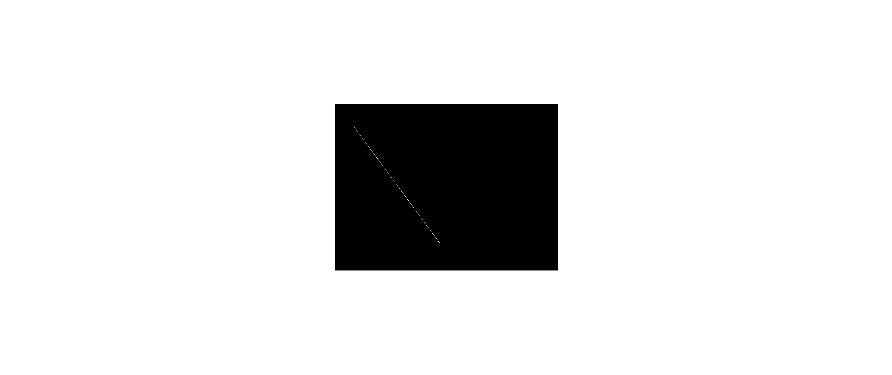
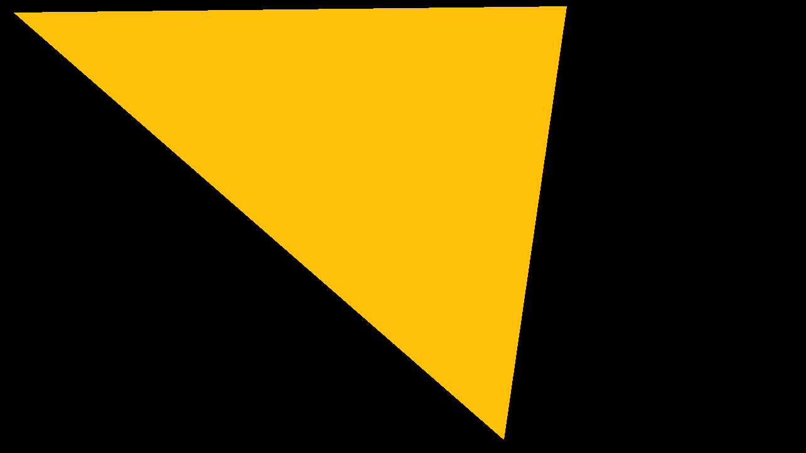

# HomeWork
An API that aims to make it as easy as possible to draw shapes in c++11.

# Why does it even exist?
I've created this api to hopefully make it easy to show to the uninitiated(esp. students) how c++ can render graphics. It's not a crazy complicated 3d rendering engine and it doesn't try to be one. It just provides functionality for drawing primitives like points, lines, rectangles etc.

# Basic usage
Making a simple app should be as straightforward as:
```c++
#include "graphics.hpp"

int main()
{
    line(50, 60, 300, 400);

    return draw();
}
```
This creates a window(640x480 default resolution) and draws a line starting at coordinate (50, 60) to (300, 400). The default color of any primitive is white(and can easily be changed), while the background color of the window is black:


Maybe 640x480 is too small for you:
```c++
#include "graphics.hpp"

int main()
{
    set_width(1280);
    set_height(720);

    triangle(20, 20, 900, 10, 800, 700, AMBER);

    return draw();
}
```
 

Please check out docs/README.md for a quick start on using the library.

# Building
You have to have cmake and SDL2 library installed to build this project. After that it's pretty simple:
```
cd /path/to/project 
mkdir build 
cd build
cmake -G"Unix Makefiles (or whatever)" -DHW_SDL2_INCLUDE_DIR=/path/to/sdl2/include -DHW_SDL2_LIBRARY_DIR=/path/to/sdl2/lib ..
make
```
And now you can link against this library and run the tests.

# Contributing 
Want to contribute? AWESOME! There's no strict guideline to follow, although following the current coding style would be great. Keep in mind contributing doesn't mean just contributing to code. Find the usage of a function confusing? Improve the documentation! Not sure it handles some specific use cases? Test it and submit the tests! Found a spelling error? Fix it!

# Limitations
* Some work needs to be done to make the api a bit more flexible.

# TODO
* Need many more tests.
* Rewrite parts of the tests to make use of the graphics.hpp header.
* Build the tests only if the user wants to.
* Make it more flexible(eg. making a custom window).
* Improve documentation.
* Organize functionality of scripts in a python package
* Translate docs/README.md to romanian
* The functions starting with lowercase letters for drawing are pretty useless right now. \
There should be a distinction between calling, for example, 'triangle' before and inside the draw call. \
If it's called before it has the behaviour that it has now(just adding it to the global vector of shapes) \
but if it's called inside the draw call(in the function given as parameter) then it should just call \
the equivalent SDL function. This means having to refactor the way the shapes are drawn, possibly \
having to make a seperate drawing api.
* Add text, sounds

For the last point:
Integrate them well with existing structures.

Example:
```c++
Rectangle r{ /*...*/ };
TextBox text{ r }; // if the rectangle is moved the text box is moved as well
TextBox text2{ 20, 20, 30, 30, YELLOW }; // create a text box with yellow background
                                        // rest of the arguments are identical to Rectangle

text.str = "Text to show";
text.font_color = RED;

music("file.mp3"); // play sound throughout the duration of the app
Sound s{ "sound.mp3" };

s.play(); // play sound.mp3
```

